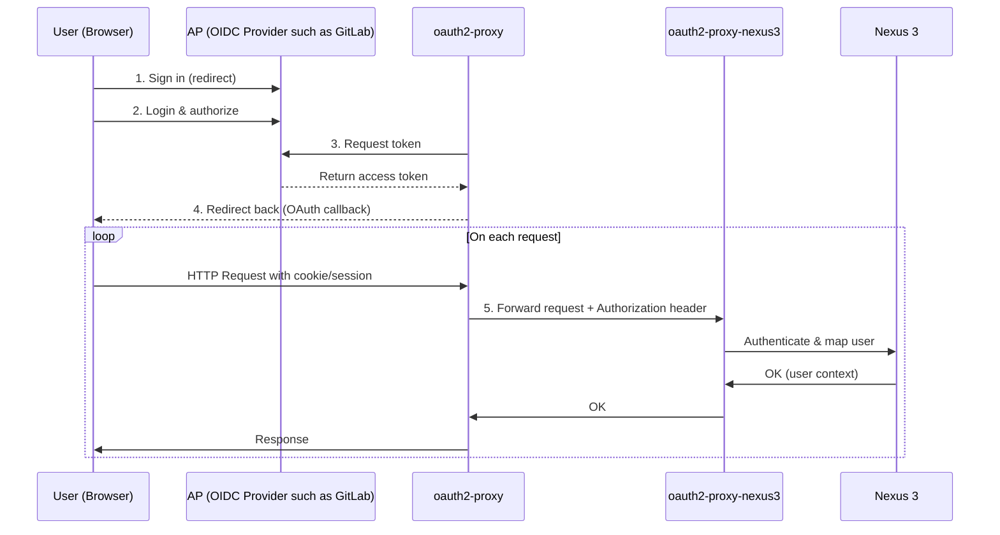

# oauth2-proxy-nexus3

This service is designed to operate as a proxy between [oauth2-proxy](https://github.com/oauth2-proxy/oauth2-proxy),
an Auth provider (AP), which is the one configured for _oauth2-proxy_, and Sonatype Nexus 3.

## Typical setup

**A demonstrative setup of this is available [here](docker/)**.

## Configuration

| ENV                              | Mandatory? | Default value            | Description                                                                                        |
| -------------------------------- | ---------- | ------------------------ | -------------------------------------------------------------------------------------------------- |
| `O2PN3_LISTEN_ON`                | ☓          | 0.0.0.0:8080             | The [IP]:PORT on which the HTTP server will listen.                                                |
| `O2PN3_SSL_INSECURE_SKIP_VERIFY` | ☓          | false                    | Skip SSL verifications if set to `true`.                                                           |
| `O2PN3_AP_URL`                   | ✓          |                          | The AP URL on which OAuth operations will be performed.                                            |
| `O2PN3_AP_ACCESS_TOKEN_HEADER`   | ☓          | X-Forwarded-Access-Token | The name of the HTTP header on which the AP OAuth _access_token_ will be provided to this service. |
| `O2PN3_NEXUS3_URL`               | ✓          |                          | The Nexus 3 URL on which sync and reverse-proxying will be performed.                              |
| `O2PN3_NEXUS3_ADMIN_USER`        | ✓          |                          | A Nexus 3 **admin** user.                                                                          |
| `O2PN3_NEXUS3_ADMIN_PASSWORD`    | ✓          |                          | A Nexus 3 **admin** password.                                                                      |
| `O2PN3_NEXUS3_RUT_HEADER`        | ☓          | X-Forwarded-User         | The name of the HTTP header used by the Rut Realm/capability (Nexus 3) for the authentication.     |

### Prerequisites

#### oauth2-proxy

The `-pass-access-token` flag must be set to `true`.

#### Nexus 3

The Rut Realm/capability must be enabled and configured the use the same HTTP header as configured in via `$O2PN3_NEXUS3_RUT_HEADER`.
